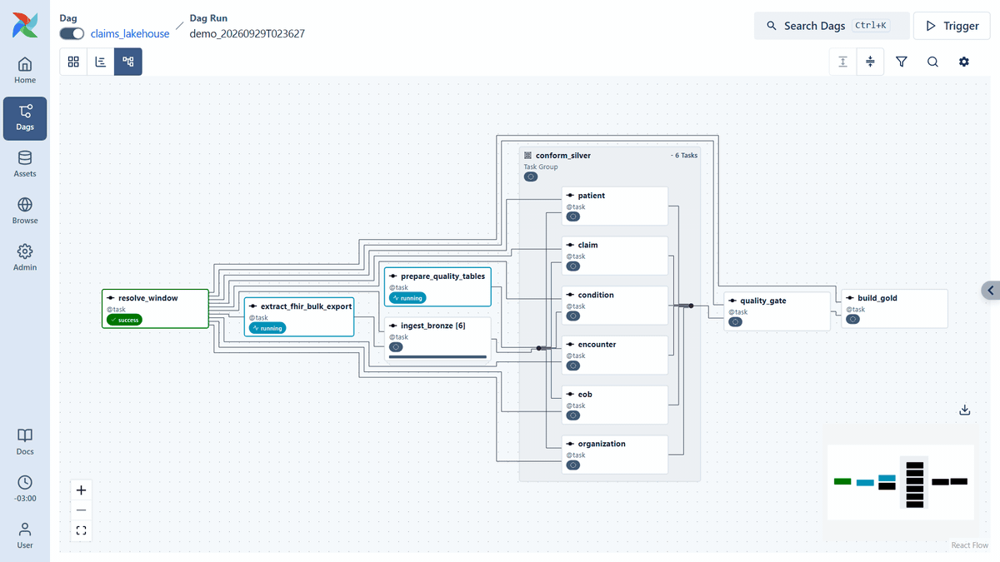
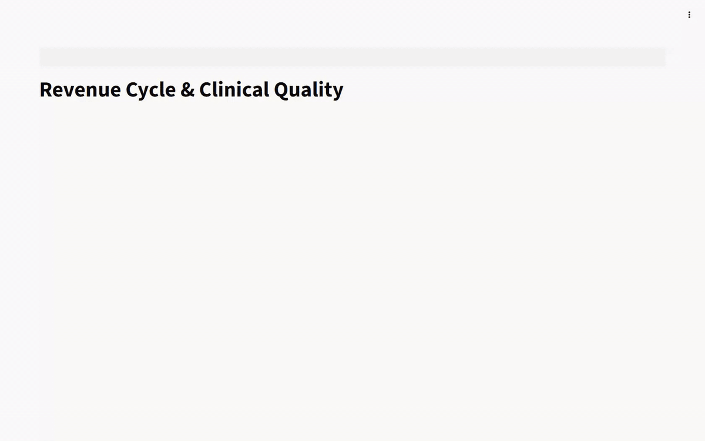
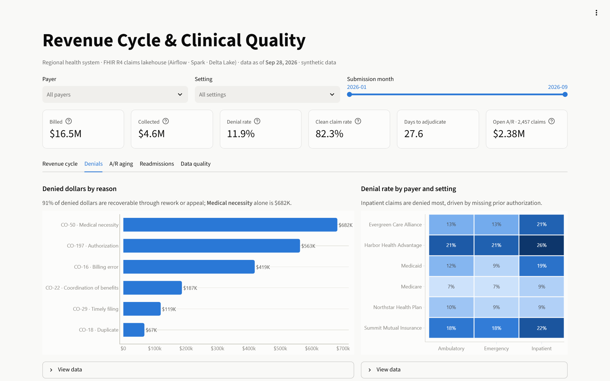
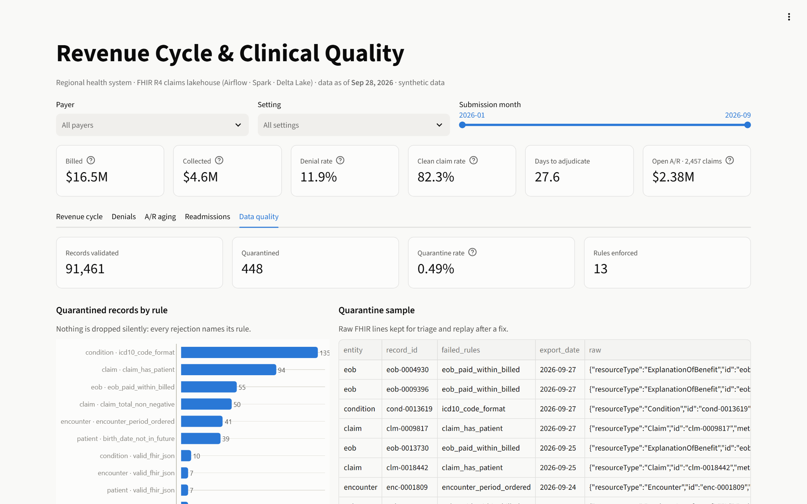
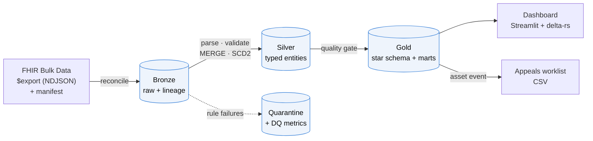
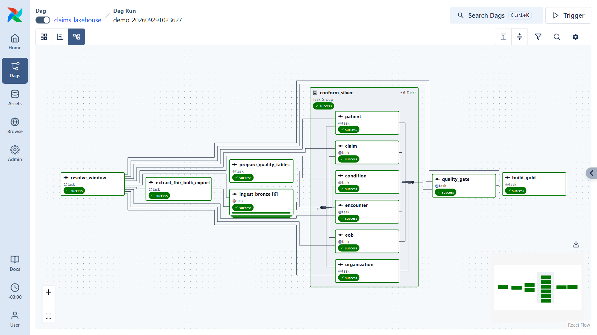
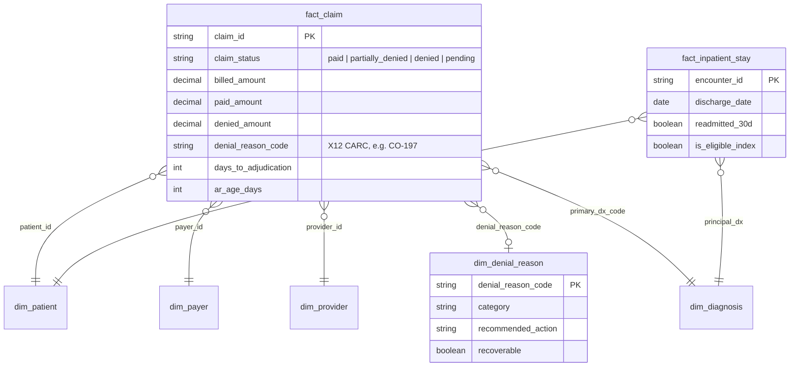

<div align="center">

# Healthcare Claims Lakehouse

**FHIR R4 claims → Airflow 3 + PySpark 4 + Delta Lake → revenue-cycle and clinical-quality analytics**

[](https://github.com/julifalvo/healthcare-claims-fhir-pipeline/actions/workflows/ci.yml)




<sub>A real run, sped up about 30×: nine months of FHIR exports go through bronze, silver, the quality gate and gold. Recorded with <code>scripts/record_demo.py</code>.</sub>

</div>

A regional health system receives its clinical and claims data as **FHIR R4 Bulk Data exports**.
This project turns those exports into a governed **Delta Lake** lakehouse and answers the
questions a revenue-cycle director and a quality officer ask every week:

- **Which payers deny our claims, and why?** Denials by X12 reason code, payer and care setting.
- **How much denied revenue can we still recover, and which claims come first?** A prioritized
  appeals worklist, regenerated automatically whenever the numbers change.
- **Where is our cash stuck?** Accounts-receivable aging, including claims the payer never answered.
- **Which patients come back within 30 days?** Readmission rates by diagnosis, the metric CMS
  uses in its Hospital Readmissions Reduction Program.
- **Can we trust these numbers?** Every rejected record is quarantined with a reason. A
  quality gate keeps bad loads out of the dashboards.

<div align="center">

</div>

## Results on the included dataset

Nine months (Jan–Sep 2026) of a synthetic health system: **10,000 patients, 7 facilities,
6 payers, ~20,500 claims, ~92,000 FHIR resources**. All numbers come from the gold layer and are
reproducible bit for bit.

| Revenue cycle | | Clinical quality & data trust | |
|---|---|---|---|
| Billed | **$16.5M** | 30-day readmission rate (all conditions) | **16.2%** |
| Collected | **$4.6M** | Heart-failure readmission rate | **26%** |
| Denial rate | **11.9%** | Records validated | **91,461** |
| Recoverable share of denied dollars | **91%** | Quarantined by DQ rules | **448 (0.49%)** |
| Open A/R | **$2.38M** (2,457 claims) | Quality rules enforced | **13** |

<table>
<tr>
<td width="50%"><br><sub><b>Denials:</b> dollars by reason code, a payer × setting heatmap, and the appeals worklist</sub></td>
<td width="50%"><br><sub><b>Data quality:</b> quarantined records by rule, with raw payloads kept for replay</sub></td>
</tr>
</table>

## Architecture



| Layer | What it holds | How it is written |
|---|---|---|
| **Landing** | NDJSON per resource type + `manifest.json`, one folder per export date | atomic folder swap |
| **Bronze** | Raw FHIR lines + source file, hash, run id | `replaceWhere` per `export_date`, counts reconciled with the manifest |
| **Silver** | `patient` (SCD2), `organization`, `encounter`, `condition`, `claim`, `claim_line`, `eob` | explicit schemas → DQ rules → quarantine or `MERGE` |
| **Gold** | `fact_claim`, `fact_inpatient_stay`, 5 dimensions, 5 marts | Spark SQL, one atomic overwrite per table |

More detail, including the daily-run sequence diagram and late-arriving adjudications, is in
[docs/architecture.md](docs/architecture.md).

## Orchestration: Airflow 3



| DAG | Trigger | What it does |
|---|---|---|
| `claims_lakehouse` | daily, or manually with a date range | extract → `ingest_bronze` (**dynamic task mapping**, one per resource) → DDL → `conform_silver` (**task group**, 6 parallel Spark jobs) → `quality_gate` → `build_gold` |
| `denials_worklist` | **data-aware**: runs when the `gold_fact_claim` **asset** updates | writes the prioritized appeals worklist for the billing team |
| `lakehouse_maintenance` | weekly | Delta `OPTIMIZE … ZORDER BY` + `VACUUM` |

Production details: a `spark` **pool** caps concurrent JVMs, retries use exponential backoff, a
failure callback serves as the alerting hook, `max_active_runs=1` stops two runs from writing to
the same tables, and the quality gate raises `AirflowFailException` so bad data is never retried.
When the lakehouse is empty, the first run **bootstraps the full history** on its own.

## Data model



Column-level definitions and metric formulas are in [docs/data-dictionary.md](docs/data-dictionary.md).

## Data quality: quarantine, don't drop

The generator injects realistic defects into about 1.2% of records: truncated JSON lines, claims without
a patient, negative totals, invalid ICD-10 codes, birth dates in the future, encounters that end
before they start, and payments above the billed amount.

| Mechanism | Where |
|---|---|
| **Manifest reconciliation**: bronze row count must equal the export manifest | `jobs/bronze.py` |
| **13 declarative rules**, one Spark SQL predicate each (NULL counts as a failure) | `quality/rules.py` |
| **Quarantine table** with the failed rules and the raw payload, replayable after a fix | `silver/_quarantine` |
| **DQ metrics** per export date, entity and rule | `gold.mart_data_quality` |
| **Quality gate**: the run fails if any entity quarantines more than 5%, and gold keeps the last good version | `quality/gate.py` |

## Engineering highlights

- **Idempotent end to end.** Atomic landing, `replaceWhere` in bronze, `MERGE` in silver, atomic
  overwrite in gold. A test runs the pipeline twice and asserts identical results.
- **Late-arriving facts.** Adjudications land 10–70 days after their claims. Pending claims age in
  A/R and resolve automatically when their EOB arrives.
- **SCD Type 2** patient history with hash-based change detection and replay-safe timelines.
- **Concurrency-safe Delta writes.** Shared tables are created by DDL before the fan-out, and
  MERGEs carry literal partition predicates so parallel writers never conflict.
- **Spark 4 ANSI mode on.** Parsing uses `try_parse_json`, `try_cast`, `try_to_timestamp` and
  `get`, so malformed input becomes a quarantined record instead of a crashed job.
- **Standards.** FHIR R4 (resources validated against the official R4B models), ICD-10-CM, CPT,
  NUBC revenue codes and X12 CARC denial codes.
- **Deterministic synthetic data.** Same seed, same bytes across processes, with a regression test
  for it.

## Quickstart

Requirements: Docker (8 GB RAM for Docker is enough) and `make`.

```bash
git clone https://github.com/julifalvo/healthcare-claims-fhir-pipeline.git
cd healthcare-claims-fhir-pipeline
make demo      # builds images, starts the stack, unpauses the DAGs
```

| Service | URL |
|---|---|
| Airflow UI (no login in local mode) | http://localhost:8080 |
| Dashboard | http://localhost:8501 |

The first run bootstraps nine months of data in about 6 minutes. After that, trigger any range
from the UI (`start_date` / `end_date` params) or with the CLI; see the [runbook](docs/runbook.md).

Without Airflow, the same pipeline runs from the CLI in one Spark session:

```bash
docker compose run --rm --entrypoint claims-pipeline airflow-scheduler \
  run --start 2026-01-01 --end 2026-09-28
```

## Testing & CI

| Suite | What it proves |
|---|---|
| Generator | determinism across processes, FHIR R4 conformance, EOBs after claims, defect injection on demand, atomic idempotent exports |
| Data quality | every broken rule is reported, corrupt JSON fails only the JSON rule, ICD-10 format |
| Silver | EOB → `paid / denied / partially_denied`, denied amounts, SCD2 (change, replay, no-op version) |
| End to end | bootstrap + incremental run, manifest reconciliation, quality gate, identical results on re-run |
| DAG integrity | DAGs import, pools exist, owners and retries set, topology (gate before gold) |

GitHub Actions runs lint, the Spark test suite on a JDK 17 runner, the DAG tests inside the Airflow
image, and a **full `docker compose` end-to-end run**: fresh deploy, bootstrap run, then the
asset-triggered worklist DAG.

```bash
make test   # all suites inside the Airflow image, no local Java or Spark needed
make lint
```

## Project structure

```
├── dags/                     # claims_lakehouse, denials_worklist, lakehouse_maintenance
├── src/claims_pipeline/
│   ├── fhir/                 # code systems + deterministic FHIR Bulk Data generator
│   ├── jobs/                 # bronze, silver (MERGE/SCD2), gold (Spark SQL), exports, maintenance
│   ├── quality/              # declarative rules, quarantine, quality gate
│   ├── pipeline.py           # stage entry points shared by Airflow, CLI and tests
│   └── spark.py              # SparkSession + Delta configuration
├── dashboard/                # Streamlit app over gold (delta-rs, no Spark)
├── docker/                   # Airflow (+JDK, PySpark, Delta jars) and dashboard images
├── tests/                    # unit, Spark, end-to-end and DAG integrity tests
├── docs/                     # architecture, data dictionary, runbook, ADRs, demo assets
└── scripts/                  # CI end-to-end driver, reproducible GIF/screenshot recorder
```

## Design decisions

| ADR | Decision |
|---|---|
| [0001](docs/adr/0001-medallion-lakehouse-on-delta.md) | Medallion lakehouse on Delta Lake |
| [0002](docs/adr/0002-fhir-bulk-data-as-ingestion-contract.md) | FHIR R4 Bulk Data as the ingestion contract |
| [0003](docs/adr/0003-spark-local-mode-inside-airflow.md) | Spark local mode inside Airflow, portable to a cluster |
| [0004](docs/adr/0004-quarantine-and-quality-gate.md) | Quarantine bad records, gate gold on quality |
| [0005](docs/adr/0005-patient-history-as-scd2.md) | Patient history as SCD Type 2 |

## Roadmap

- Replace the generator with a live `$export` from a FHIR server (HAPI FHIR or Synthea) behind the same contract.
- Incremental gold (`MERGE` of touched claims) and a Spark Connect server to remove per-task JVM startup.
- Point-in-time joins against the SCD2 patient dimension (state at date of service).
- OpenLineage from Airflow + Spark into Marquez or DataHub.
- Denial-risk model trained on `fact_claim`, scored before submission.

## Disclaimer

All data is **synthetic** and generated by `src/claims_pipeline/fhir/generator.py`. Patients,
organizations and payers are fictional. No PHI is used anywhere. CPT codes are used only as
identifiers, with short, original descriptions.

## License

[MIT](LICENSE)
