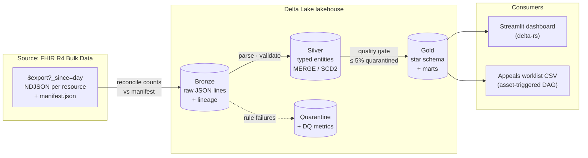
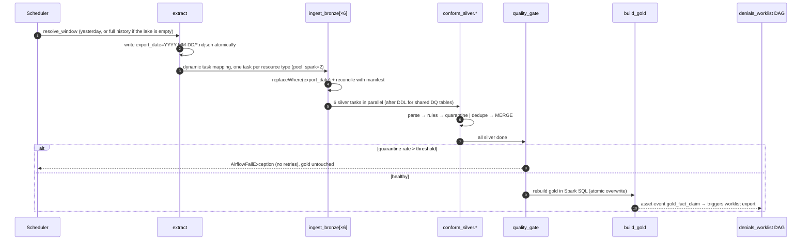

# Architecture

## Data flow

## One daily run

## Late-arriving adjudications

A claim is exported on the day it is submitted. Its ExplanationOfBenefit shows up in a later
export, between 10 and 70 days afterwards depending on the payer. Silver upserts EOBs by id,
and gold joins each claim to its latest adjudication on every run. So:

- claims without an EOB are `pending` and age in `mart_ar_aging`;
- when the EOB lands, the next run flips the claim to `paid`, `denied` or `partially_denied`, with
  no special handling;
- about 1.5% of claims never get a response. They surface as 90+ day A/R, which is exactly the
  follow-up list a billing team needs.

## Idempotency by layer

| Stage | Mechanism | Re-run effect |
|---|---|---|
| Extract | write to `.tmp_export_date=…`, then rename | same files |
| Bronze | `replaceWhere export_date IN (…)` | same partitions replaced |
| Silver | `MERGE` on business key, newer `last_updated` wins | no-op |
| Patient SCD2 | rebuild the affected timelines, one `MERGE` with upsert + delete | no-op |
| Quarantine / DQ | `MERGE` on `(entity, record_hash)` / `(entity, export_date, rule)` | no-op |
| Gold | overwrite (single Delta commit) | identical tables |

The end-to-end test runs the pipeline twice over the same window and asserts identical silver
row counts and gold outputs. A separate test proves the generator gives the same output across
processes: a set-iteration-order bug once shifted ids between runs and broke the MERGEs.

## Scaling notes

- Spark runs in local mode inside the Airflow worker. Point `SPARK_MASTER` at a cluster, or swap
  the task bodies for `SparkSubmitOperator` / Databricks operators. The job modules do not change (ADR 0003).
- Bronze and silver are processed per export-date window, so daily runs touch one partition.
- Gold is a full rebuild because it is small. The documented path to incremental is a `MERGE` of
  `fact_claim` restricted to claims touched in the window.
- `lakehouse_maintenance` compacts and Z-orders silver on the join keys used by gold
  (`patient_id`, `payer_id`, `claim_id`).
